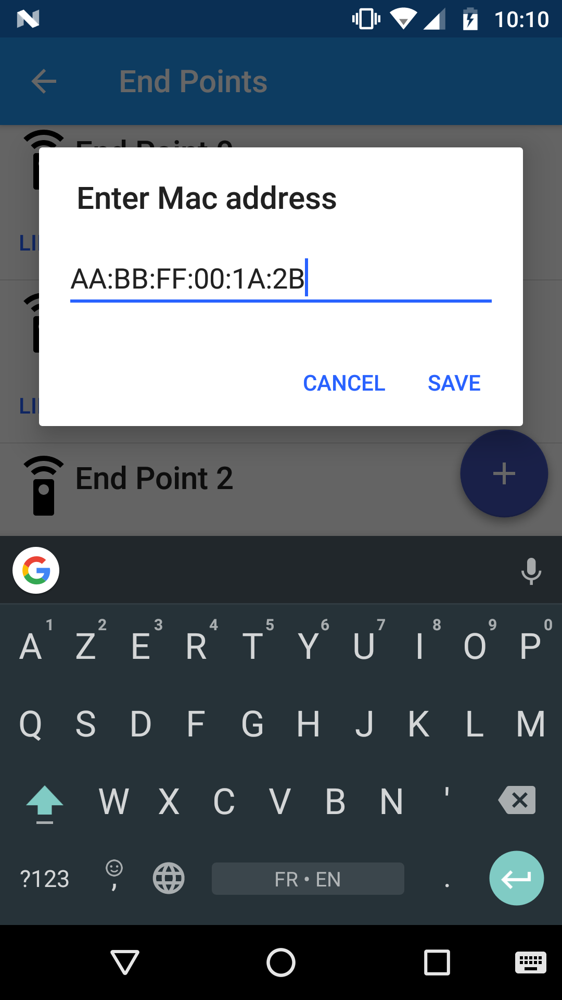

# Mac Address EditText
[](https://jitpack.io/#phearme/macaddress-edittext)

Android EditText component for handling mac address input format



Inspired by cimikavac's post: http://cmikavac.net/2014/01/16/android-edittext-automatic-mac-address-formatting/
## Installation
Add the JitPack repository to your root **Project** gradle file at the end of repositories:
```gradle
allprojects {
	repositories {
		...
		maven { url 'https://jitpack.io' }
	}
}
```
Add the dependency to the **Module** gradle file:
```gradle
dependencies {
	...
	compile 'com.github.phearme:macaddress-edittext:1.0.1'
}
```
## Usage
```xml
<com.phearme.macaddressedittext.MacAddressEditText
	android:layout_width="match_parent"
	android:layout_height="wrap_content" />
```

[](https://www.buymeacoffee.com/raphael.cohen)
